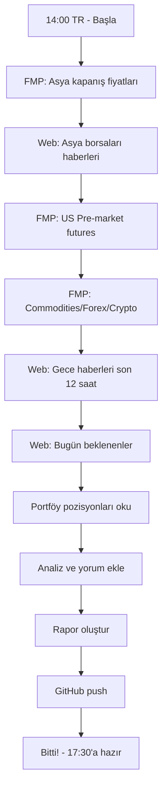

# 📋 GÜNLÜK RAPOR STRATEJİSİ

## ⏰ ZAMANLAMA

**Her Gün Türkiye Saati 14:00'te** (06:00 EST)

**Neden 14:00?**
- Asya borsaları kapanmış (Tokyo, Hong Kong, Shanghai)
- ABD pre-market aktif (04:00-09:30 EST → 12:00-17:30 TR)
- Futures fiyatları güncel
- Gece ABD'de olan haberleri toplamış
- ABD açılışına 3.5 saat var (17:30 TR → 09:30 EST)

---

## 📊 VERİ KAYNAKLARI

### **1. FMP API** ✅
**Kullanım:** Finansal veriler

```
✅ Hisse fiyatları (quote)
✅ Pre-market fiyatları (pre/post market)
✅ Finansal rasyolar
✅ Company profiles
✅ Earnings data
✅ Analyst estimates
✅ Index data (S&P, Nasdaq, Dow)
✅ Commodity prices (oil, gold)
✅ Forex rates
✅ Crypto prices

❌ Haberler (Legacy endpoint - kapalı!)
```

**Endpoint Örnekleri:**
```python
# Pre-market fiyat
f"https://financialmodelingprep.com/api/v3/quote/{symbol}?apikey={key}"

# Index data
f"https://financialmodelingprep.com/api/v3/quotes/index?apikey={key}"

# Commodities
f"https://financialmodelingprep.com/api/v3/quote/CRUDE_OIL,GOLD?apikey={key}"

# Forex
f"https://financialmodelingprep.com/api/v3/fx?apikey={key}"
```

### **2. WEB SEARCH** ✅
**Kullanım:** Haberler ve piyasa sentiment

```
✅ Genel piyasa haberleri
✅ Şirket-specific haberler
✅ Jeopolitik gelişmeler (İran, Rusya, vb.)
✅ Fed/ECB/BOJ haberleri
✅ Earnings rapor yorumları
✅ Analist raporları
✅ Sentiment analizi
```

**Search Terimleri:**
```
"Asian markets today"
"Pre-market futures"
"Oil prices today"
"Fed interest rates"
"Iran tensions"
"[SYMBOL] stock news today"
```

---

## 📝 RAPOR İÇERİĞİ (Her Sabah 14:00 TR)

### **1. ASYA BORSALARI** (Gece Kapanış)
```
□ Nikkei 225 (Tokyo)
□ Hang Seng (Hong Kong)
□ Shanghai Composite (Çin)
□ KOSPI (Kore)
□ ASX 200 (Avustralya)
□ Nifty 50 (Hindistan)

Kaynak: Web search + "Asian markets close today"
```

### **2. ABD PRE-MARKET** (Şu Anki Durum)
```
□ S&P 500 Futures
□ Dow Futures
□ Nasdaq Futures
□ VIX (Korku endeksi)
□ 10Y Treasury Yield

Kaynak: FMP API + Web search
```

### **3. COMMODITIES** (Güncel)
```
□ WTI Crude Oil
□ Brent Oil
□ Gold
□ Silver
□ Natural Gas

Kaynak: FMP API
```

### **4. FOREX** (Güncel)
```
□ USD/EUR
□ USD/JPY
□ USD/TRY
□ DXY (Dollar Index)

Kaynak: FMP API
```

### **5. CRYPTO** (Güncel)
```
□ Bitcoin
□ Ethereum

Kaynak: FMP API
```

### **6. GECE HABERLERİ** (Son 12 Saat)
```
□ Top 5 piyasa haberi
□ Jeopolitik gelişmeler
□ Fed/merkez bankaları
□ Earnings sürprizleri
□ Analist önerileri

Kaynak: Web search
```

### **7. BUGÜN BEKLENstrENLER**
```
□ Economic data releases
□ Earnings announcements
□ Fed speeches
□ Geopolitical events

Kaynak: Web search + FMP earnings calendar
```

### **8. PORTFÖYLERİMİZ İÇİN YORUM**
```
□ Enerji pozisyonları
□ Tech watchlist
□ Swing trade durumu
□ Risk assessment
□ Bugün yapılacaklar

Kaynak: Manuel analiz
```

---

## 🔧 OTOMASYON AKIŞI



---

## 📄 RAPOR FORMATI

**Dosya Adı:** `GUNLUK_RAPOR_[TARIH].md`

**Bölümler:**
1. **Özet** (3 kritik nokta)
2. **Asya Borsaları** (Gece kapanış)
3. **ABD Pre-Market** (Şu an)
4. **Commodities & Forex** (Güncel)
5. **Gece Haberleri** (Top 5-10)
6. **Bugün Beklenenler** (Data + Events)
7. **Portföy Durumu** (Pozisyonlarımız)
8. **Bugün Yapılacaklar** (To-do list)
9. **Strateji** (Kısa vadeli öneri)

---

## 🎯 AMAÇ

**17:30 TR (09:30 EST) Açılışına Hazır Olmak!**

Rapor şunları sağlamalı:
1. Gece ne olduğunu bil (Asya + Haberler)
2. Şu an ne durumda (Pre-market)
3. Bugün ne bekleyeceğini bil (Data + Events)
4. Portföyler için plan yap (Trade decisions)
5. Açılışta hemen aksiyon alabilsin

---

## ⚙️ TEKNİK DETAYLAR

### **FMP API Rate Limits:**
- Free Plan: 250 requests/day
- Her rapor: ~20-30 request
- Günde 1 rapor: Yeterli ✅

### **Web Search Stratejisi:**
- Geniş query'ler (daha az arama)
- Kaliteli kaynaklar (CNBC, Bloomberg, Reuters)
- Son 12 saat filtresi

### **GitHub Workflow:**
```bash
1. Rapor oluştur: GUNLUK_RAPOR_20_SUBAT.md
2. Git add + commit
3. Git push
4. Bildirim: "14:00 Raporu Hazır!"
```

---

## 📌 ÖNEMLİ NOTLAR

1. **Saat Gösterimi:**
   - Türkiye saati (Istanbul +3)
   - ABD saati parantez içinde (EST)
   - Örnek: 17:30 TR (09:30 EST)

2. **Ton:**
   - Profesyonel, yalın
   - Abartısız (Mükemmel/Bravo yok)
   - Veriye dayalı

3. **FMP API:**
   - Haberler ÇALIŞMIYOR ❌
   - Sadece finansal veri ✅

4. **Hedef:**
   - Sabah 14:00'te rapor
   - 17:30 açılışına hazır
   - Actionable insights

---

**Hazırlayan:** Portfolio Management AI  
**Güncellenme:** 20 Şubat 2026  
**Versiyon:** 1.0
